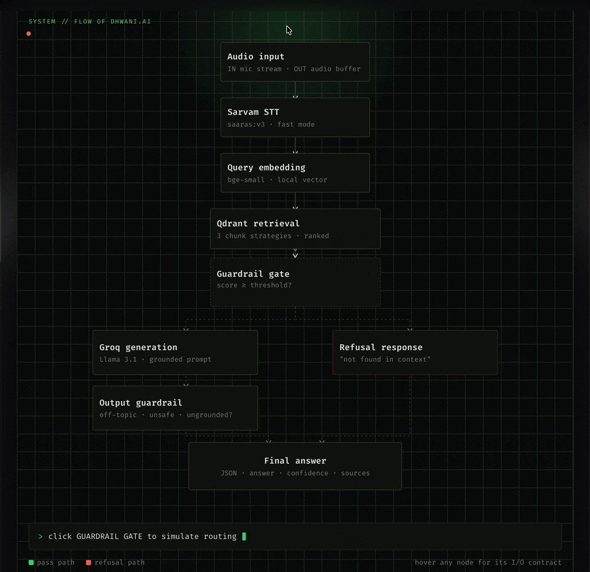
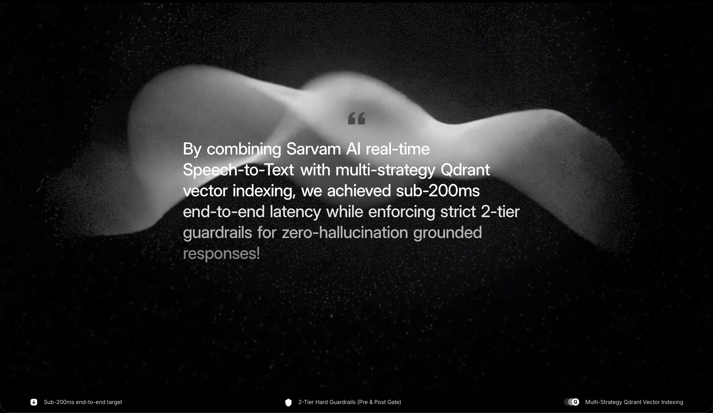

# ध्वनि.ai — Voice-Enabled RAG Pipeline (HH Goa 2026 Task 2)

High-performance, voice-enabled Retrieval-Augmented Generation (RAG) system for Hindi, built with Sarvam AI STT, local `bge-small` embeddings, multi-strategy Qdrant retrieval, Groq (Llama) generation, and a strict two-tier hard guardrail gate.

**🔗 Live demo:** https://dhwani-ai-s37j.onrender.com

**📖 Architecture walkthrough:** https://dhwani-ai-s37j.onrender.com/architecture

**📑 API docs (Swagger):** https://dhwani-ai-s37j.onrender.com/docs

---


## Key Features

- **Sarvam AI Streaming STT** — real-time Hindi speech-to-text (`saaras:v3-realtime`) with `stream_type="fast"` for minimal time-to-first-token.
- **Multi-Strategy Retrieval** — 3 chunking strategies, each indexed as a separate Qdrant collection so retrieval quality can be compared directly rather than blended:
  1. Native passage-level chunking (dataset-provided boundaries)
  2. Sentence-window chunking (±1 sliding context window)
  3. Semantic chunking (cosine-similarity grouping)
- **Zero-Round-Trip Embeddings** — `bge-small` runs 100% locally (CPU/Metal) to stay inside the sub-200ms retrieval+generation budget.
- **Two-Tier Hard Guardrails**:
  - **Pre-generation gate** — refuses queries with retrieval confidence below threshold (`< 0.45`) or flagged as harmful/off-topic before they ever reach the LLM.
  - **Post-generation gate** — vetoes outputs that are ungrounded, off-topic, or unsafe even after generation.
- **Automated Latency Benchmarking** — measures P50 / P70 / P100 across a real query set, not a single best-case run.

---

## Architecture




Full component contracts (I/O types, models, thresholds) are documented on the [architecture page](https://dhwani-ai-s37j.onrender.com/architecture).

---

##  Project Structure

```
/app
  main.py         # FastAPI orchestration & pre-warming engine
  stt.py          # Sarvam STT integration
  embed.py        # Multilingual MiniLM 384-dim local embedding
  retrieval.py    # Qdrant client & 3-strategy chunking store
  generate.py     # Groq Llama grounded generation
  guardrails.py   # 2-tier confidence gate & output validator
  schemas.py      # Pydantic models for boundary validation
  benchmark.py    # Latency test harness (P50/P70/P100)
/data
  ingest.py       # MSMARCO-XI Hindi subset ingester
/vesper_frontend
  index.html          # Main application UI
  architecture.html   # System architecture walkthrough
/tests
  test_guardrails.py  # Guardrail unit tests
```

---

##  Environment Setup

1. Copy `.env.example` to `.env`:
   ```bash
   cp .env.example .env
   ```
2. Add your API credentials in `.env`:
   ```env
   SARVAM_API_KEY=your_sarvam_api_key
   GROQ_API_KEY=your_groq_api_key
   QDRANT_URL=http://localhost:6333
   ```
3. Install dependencies:
   ```bash
   pip install -r requirements.txt
   ```

---

## Running the Application

### Start the FastAPI server
```bash
uvicorn app.main:app --host 0.0.0.0 --port 8000 --reload
```

Endpoints:
- **`GET /`** — API status & configuration
- **`POST /api/query`** — execute the RAG pipeline for text queries
- **`POST /api/stt/transcribe`** — transcribe an audio input
- **`WS /ws/rag`** — real-time audio stream endpoint
- **`GET /docs`** — Swagger API reference

### Ingest the dataset
```bash
python data/ingest.py
```
Loads `ai4bharat/MSMARCO-XI` (Hindi subset), builds all 3 chunking-strategy collections, and populates Qdrant.

---

## Testing & Benchmarking

### Run guardrail unit tests
```bash
pytest tests/test_guardrails.py
```

### Run the latency benchmark (P50 / P70 / P100)
```bash
python app/benchmark.py
```
Runs 30+ queries against the MSMARCO-XI Hindi dataset, logs per-query latency breakdowns (embedding, retrieval, guardrail, generation), computes percentiles, and writes `benchmark_results.json`.

### 📊 Latency Results

*(post-transcription: embedding → retrieval → guardrail → generation)*

| Percentile | Latency | Target |
|---|---|---|
| P50 | `TODO ms` | < 200ms |
| P70 | `TODO ms` | < 200ms |
| P100 | `TODO ms` | < 200ms |

Full breakdown: [`benchmark_results.json`](./benchmark_results.json)

---

## Guardrails in Practice

| Scenario | Expected behavior |
|---|---|
| Query well-covered by indexed passages | Grounded answer returned with source citations |
| Off-topic query (outside MSMARCO-XI domain) | Pre-generation gate refuses before LLM call |
| Low retrieval confidence (`score < 0.45`) | Pre-generation gate refuses |
| Ungrounded/hallucinated generation | Post-generation gate vetoes the output |

Interactive simulation available on the [architecture page](https://dhwani-ai-s37j.onrender.com/architecture) — click "Guardrail Gate" to see both pass and refusal paths.

---

## Dataset & Attribution

Built on [`ai4bharat/MSMARCO-XI`](https://huggingface.co/datasets/ai4bharat/MSMARCO-XI) (Hindi subset), part of AI4Bharat's IndicRAGSuite. Each example provides a query, reference answers, and retrieval passages.

---
## `#RAGInGoa`


